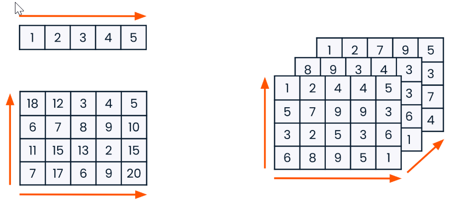
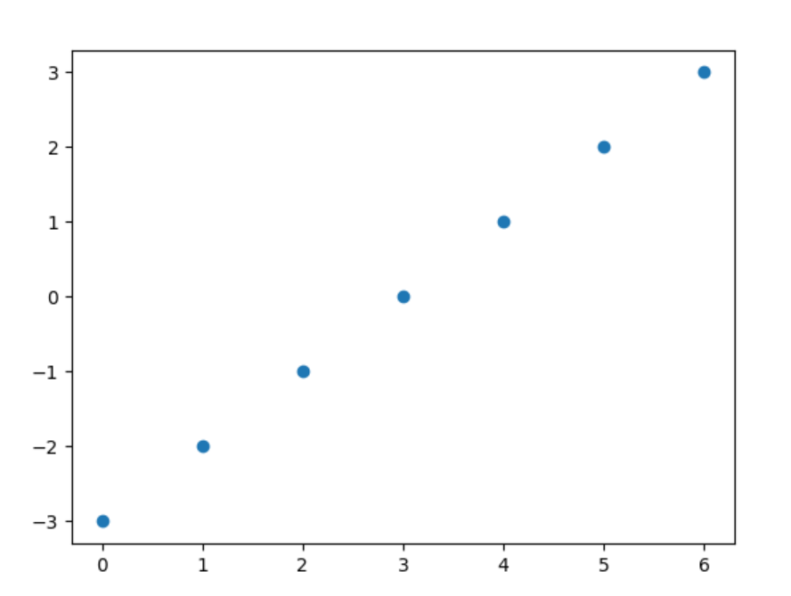
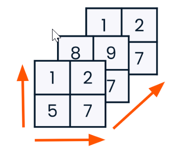
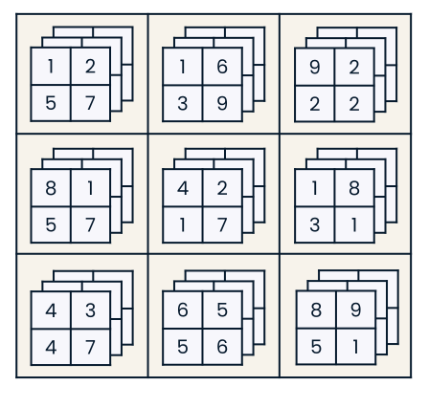
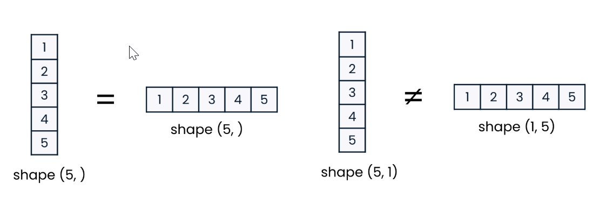
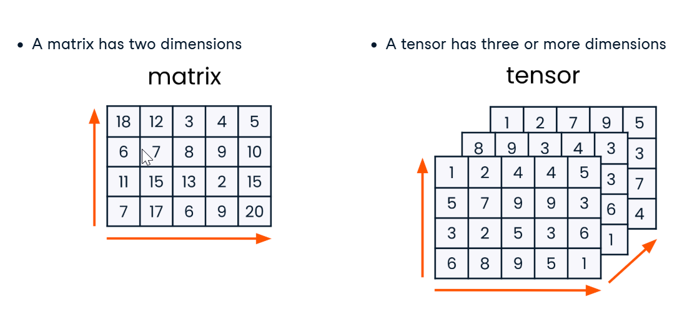

# Numpy Arrays
The main object in numpy, it's a grid -like structure that holds data. An array can have any number of dimensions and each dimension can be any length



# How to create a Numpy Array
First Import The Numpy module using
```python
import numpy as np
```
## Creating a 1D array from lists
To Create a 1D numpy array from a list, you simply need to pass it a list of data and it will make a numpy array containing that data
```python
python_list = [3,2,5,8,4,9,7,6,1]
array = np.array(python_list)
print(array)
# Output: [3 2 5 8 4 9 7 6 1]
print(type(array))
# Output: <class 'numpy.ndarray'>
```

## Creating a 2D array from lists
Same as a 1D array, however instead you pass it a list of lists instead.
```python
python_list_of_lists = [
    [3,2,5],
    [9,7,1],
    [4,3,6]
]
array = np.array(python_list_of_lists)
print(array)
# Output:
# [[3 2 5]
# [9 7 1]
# [4 3 6]]
```
## Creating arrays from scratch
There are many NumPy functions used to create arrays fom scratch, including:
- `np.zeros((x,y))`
  - Creates an array of zero's depending on the parameters given in an Integer Tuple (X,Y). X being Width and Y being Height.
  - Good for creating an array and filling with data later on.
- `np.random.random((x,y))`
  - Creates an array of random numbers between 1 and 0 depending on the parameters given in a Integer Tuple (X,Y). X being Width and Y being Height.
  -  It contains .random twice as `np.random` is the random module in numpy and the second `.random` is the function name within the module.
- `np.arange(x,y,z)`
  - Creates an evenly-spaced array of numbers based on a given start (x) and stop (y) values.
  - By default, it will create an array of sequential integers. The start value is included in the output array, but the stop value is not.
  - If a third argument (z) is passed, it is interpreted as a step value. Now the desired distance between elements is that Z Value.
  - `np.arange()` is useful for plotting.
  - ```python
    from matplotlib import pyplot as plt
    plt.scatter(np.arange(0,7),
                np.arange(-3, 4))
    ```
    

# Why use arrays instead of lists
## Python Lists
- Can contain many different data types.
```python
python_list = ['beep', False, 56, .945, [3,2,5]]
```
## Numpy Lists
- Can contain only a single data type.
```python
numpy_boolean_array = [[True, False], [True, True], [False, True]]
numpy_float_array = [1.9, 5.4, 8.8, 3.6, 3.2]
```
## why?
With Numpy arrays allowing only a single data type, it makes it very efficient.
As there is no need to check the data type of each element as in an array, they all must be the same.
Having only a single data type also means that a NumPy array takes up less space in the memory than the same information would if stored as a python list.

# Array Dimensionality
one of NumPy's key strengths: the ability to handle data of any dimension.

## Creating a 3D array
Just as we can create a 2D array by feeding numPy a list of lists, we can create a 3D array by creating a list of lists of lists.
Alternatively, we could create an array of 2D lists.
We can visualise a 3D array as a bunch of 2D arrays with the same shape stacked on top of each other.


```python
import numpy as np

array_1_2D = np.array([[1, 2], [3, 4]])
array_2_2D = np.array([[5, 6], [7, 8]])
array_3_2D = np.array([[1, 2], [7, 8]])
array_3D = np.array([array_1_2D, array_2_2D, array_3_2D])
```

## 4D Array
Four-dimensional arrays can be harder to visualize since we don't have a fourth dimension. Think of a 4D array as a 2D array filled with 3D arrays.


```python
import numpy as np

array_4D = np.array([array_A_3D, array_B_3D, array_C_3D, array_D_3D, array_E_3D, array_F_3D, array_G_3D, array_H_3D, array_I_3D])
```

## Vector arrays
Programmers and the NumPy documentation sometimes refer to arrays as vectors, matrices, or tensors. These are mathematical terms rather than NumPy terms; they all describe types of arrays. 
The difference between them is the number of dimensions an array has. A vector refers to an array with one dimension. There is no difference between row and column (or horizontal and vertical) vectors in NumPy since no second axis is specified for 1D arrays.
To create an array that is explicitly horizontal or vertical, it must be a 2D array so that NumPy understands what axis it lies on, like the arrays on the right. Since these arrays are two-dimensional rather than one-dimensional, it would not be correct to call them vectors.

## Matrix and Tensor Arrays
In mathematics, a two-dimensional array is called a matrix. And an array with three or more dimensions is called a tensor.


## shapeshifting
Array attributes are properties of an instance of an array, such as the array's shape. Array methods like `.flatten` and `.reshape`
are called directly on the array object itself rather than passing the array as an argument like we do with NumPy functions such as `np.array`.

### Finding an Array's Shape
`.shape` describes the shape of an array and returns a tuple of the length of each dimension. A shape of (3, 5) indicates a 2D array with three rows and five columns.
```python
array = np.zeros((3,5))
print(array)
# Output:
# array([[0.,0.,0.,0.,0.],
#        [0.,0.,0.,0.,0.],
#        [0.,0.,0.,0.,0.]])
array.shape
# output:
# (3,5)
```

### Flattening an array
It's often easier to manipulate one-dimensional data than large multidimensional arrays. `np.flatten` can help here: it takes all array elements and puts them in just one dimension inside a 1D array.
```python
array = np.array([1,2],[5,7],[6,6])
array.flatten()
print(array)
# Output:
# array([1,2,5,7,6,6])
```

### Reshaping an array
The dot-reshape method allows us to redefine the shape of an array without changing the elements that make up the array. In this example,
we take a 2D array with three rows and two columns and change it into a 2D array with two rows and three columns. The shape tuple passed to 
`.reshape` must be compatible with the number of elements in an array. This array could not be reshaped to a shape of (3, 3), since three times 
three is nine, and the array has only six elements.
```python
array = np.array([[1,2], [5,7], [6,6]])
array.reshape((2,3))
```
```terminaloutput
array([[1,2,5],[7,6,6]])
```
```python
array.reshape((3,3))
```
```terminaloutput
ValueError: cannot reshape array of size 6 into shape (3,3)
```